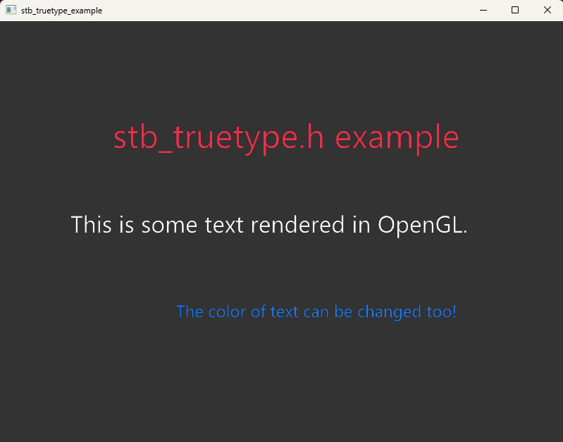

# stb-truetype-example
A Simple Demo of Loading and Rendering Fonts using stb_truetype.h

The following demo demonstrates the usage of [stb_truetype.h](https://github.com/nothings/stb/blob/master/stb_truetype.h).
The approach used here is to build a fixed size font atlas and render the corresponding glyphs from the font atlas texture using data provided by the corresponding structures 

I've made a guide on [dev.to](https://dev.to/shreyaspranav/how-to-render-truetype-fonts-in-opengl-using-stbtruetypeh-1p5k) describing the usage of `stb_truetype.h`. This is the demo of that guide.

## Screenshot

